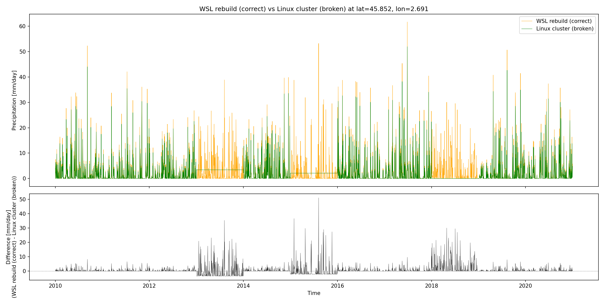
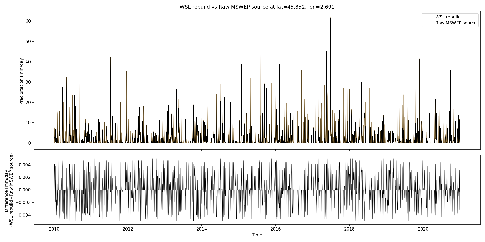
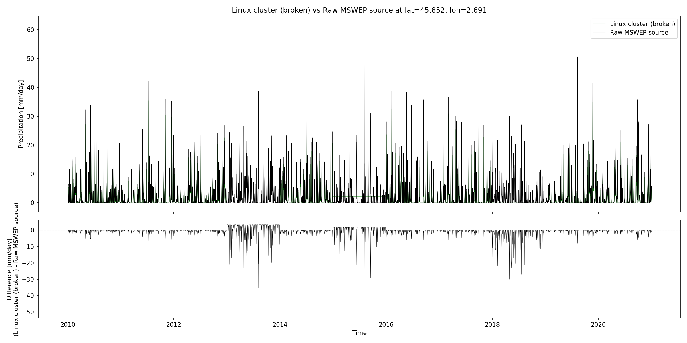

# Investigation: hydromt_wflow Issue #741

**Issue:** [Deltares/hydromt_wflow#741](https://github.com/Deltares/hydromt_wflow/issues/741)  
**Summary:** Precipitation forcing built on a Linux cluster (h7) contains broken years where a single spatial pattern is repeated for all 365 days, while builds on Windows/WSL produce correct output.

## The Bug

When building a wflow model with `setup_precip_forcing` using MSWEP V316 daily data on the Deltares h7 cluster, certain years in the output forcing contain **constant precipitation** — the same spatial pattern repeated every timestep for the entire year.

Broken years in the reporter's model: **1991, 2000, 2009, 2013, 2015, 2018**

Each broken year contains data from an *adjacent* year's first day:
- 1991 → has 1990 day 0 pattern
- 2000 → has 2001 day 0 pattern  
- 2009 → has 2010 day 0 pattern
- 2013 → has 2014 day 0 pattern
- 2015 → has 2016 day 0 pattern
- 2018 → has 2017 day 0 pattern

The offset is not consistent (+1 or -1), suggesting data chunk misrouting rather than an off-by-one error.

## Results

Generated with:

```bash
pixi run python scripts/plot_issue_comparison.py --start 2010 --end 2020
```

### WSL rebuild vs Linux cluster (broken)



The WSL rebuild (orange) shows correct daily precipitation variation. The cluster build (green) goes flat during 2013, 2015, and 2018 — constant near-zero values for the entire year. The difference panel clearly shows the missing precipitation as large negative spikes during those years.

### WSL rebuild vs Raw MSWEP source



The WSL rebuild matches the raw MSWEP source almost exactly. The difference is ±0.005 mm/day — just floating-point rounding from nearest-neighbor spatial reprojection. This confirms the WSL rebuild correctly processes the source data.

### Linux cluster (broken) vs Raw MSWEP source



The cluster build deviates massively from the raw source during broken years, with differences reaching -30 to -50 mm/day. Real rainfall events are completely lost and replaced by a single repeated spatial pattern.

## Environment Comparison

| Package | Cluster (broken) | WSL/pixi (works) |
|---------|-------------------|-------------------|
| Python | 3.14.3 | 3.13.13 |
| hydromt | 1.3.0 | 1.4.0.dev0 |
| hydromt_wflow | 1.0.1 | 1.0.3.dev0 |
| xarray | 2026.2.0 | 2026.4.0 |
| dask | 2026.1.2 | 2026.3.0 |
| **distributed** | **2026.1.2** | **not installed** |
| numpy | 2.3.5 | 2.4.3 |
| pandas | 2.3.3 | 3.0.2 |
| rioxarray | 0.21.0 | 0.22.0 |
| rasterio | 1.5.0 | 1.5.0 |
| netCDF4 | 1.7.4 | 1.7.4 |

The `conda_list.txt` / `pip_list.txt` files contain the reporter's full cluster environment. The `conda_list_h7.txt` / `pip_list_h7.txt` files are from an older environment on the same cluster (hydromt 1.3.1, dask 2024.11.2).

## What Was Investigated

### 1. File ordering via `set()` — ELIMINATED

The `convention_resolver.py` in hydromt uses `set()` when resolving wildcard URIs, which gives non-deterministic ordering. However, since `open_mfdataset` uses `combine='by_coords'`, files are sorted by their time coordinate values regardless of input order. This cannot cause the bug.

### 2. Source data integrity — CONFIRMED OK

All 47 MSWEP source files (1979-2025) have proper `datetime64` time coordinates. The time dimension is correctly encoded and decoded. Loading any single file and reprojecting it produces correct temporal variation.

### 3. Yearly resample boundaries — ELIMINATED

The `resample_time` function in `meteo.py` uses pandas `YE` grouping. Since source data is daily and output is daily, `dfreq ≈ 1.0` and NO resampling actually occurs — data passes through unchanged.

### 4. Single-file reproject — WORKS

Loading one year's MSWEP file, clipping to the model bbox, and reprojecting with `method='nearest_index'` produces correct results. Days differ from each other as expected.

### 5. Multi-file reproject — WORKS ON WSL

Loading 3 years via `open_mfdataset(combine='by_coords', parallel=True, chunks={time:1})`, clipping, and reprojecting also works correctly on WSL. The bug does NOT reproduce without the `distributed` scheduler.

### 6. Full model rebuild on WSL — ALL YEARS CORRECT

Building the complete model (1988-2021) on WSL with hydromt 1.4.0.dev0 produces correct forcing for all years, including the ones broken in the reporter's model (2013, 2015, 2018).

## Root Cause Hypothesis

The bug is most likely caused by **dask.distributed scheduler misrouting chunk data** during the `map_blocks` operation in `reindex2d()` (called by `reproject_like(method='nearest_index')`).

Evidence:
- Time **coordinates** are always correct — only the **data values** are wrong
- The bug only affects *some* years non-deterministically
- It does NOT reproduce without `distributed` (WSL uses synchronous scheduler)
- The `reindex2d` function uses `map_blocks` with `chunksize = max(self._obj.chunks[0])` = 1, creating 17,000+ individual tasks for the full 47-year dataset
- On a cluster with distributed scheduler, task scheduling order is non-deterministic

Possible contributing factors:
- `dask 2026.1.2` may have a scheduling bug fixed in 2026.3.0
- `xarray 2026.2.0` may have a `map_blocks` issue fixed in 2026.4.0
- Python 3.14 GIL changes could affect threading behavior

## Reproduction

### Prerequisites

- pixi installed
- Access to `/p/wflow_global/` network mount (for source data and static maps)
- Clone `hydromt` and `hydromt_wflow` repos as siblings (for the default dev environment)

### Quick start (WSL/local — will NOT reproduce the bug)

```bash
pixi run full-reproduce    # Build + update model
pixi run python scripts/plot_issue_comparison.py --no-raw --start 2010 --end 2020
```

### Reproduce on h7 cluster (likely WILL reproduce the bug)

```bash
pixi run -e h7 update      # Uses reporter's pinned versions with distributed
pixi run -e h7 python scripts/plot_issue_comparison.py --no-raw
```

### Generate plots

```bash
# All 3 pair plots without raw MSWEP (fast, no /p/ access needed)
pixi run python scripts/plot_issue_comparison.py --no-raw --start 2010 --end 2020

# All 3 pair plots with raw MSWEP source (slower, needs /p/ access)
pixi run python scripts/plot_issue_comparison.py --start 2010 --end 2020

# Custom lat/lon and output prefix
pixi run python scripts/plot_issue_comparison.py --lat 45.85 --lon 2.69 --start 1988 --end 2021 -o my_comparison.png
```

This produces:
- `*_wsl_vs_cluster.png` — WSL rebuild vs broken cluster build
- `*_wsl_vs_raw.png` — WSL rebuild vs raw MSWEP source (only with `--no-raw` omitted)
- `*_cluster_vs_raw.png` — Broken cluster build vs raw source (only with `--no-raw` omitted)

## Next Steps

1. **Test on h7 with `pixi run -e h7 update`** — confirm the bug reproduces with `distributed`
2. **Test with distributed locally** — add `distributed` to the default env and run with `dask.distributed.Client()` to isolate the scheduler as root cause
3. **Check dask/xarray changelogs** between 2026.1.2→2026.3.0 and 2026.2.0→2026.4.0 for relevant fixes
4. **Try disabling `parallel: true`** in the data catalog — this controls `open_mfdataset(parallel=True)` which uses threads/dask to open files concurrently
5. **Try larger time chunks** — changing `chunks: {time: 1}` to `{time: 365}` in the catalog would reduce the task graph from 17K to 47 tasks, potentially avoiding the scheduler issue
